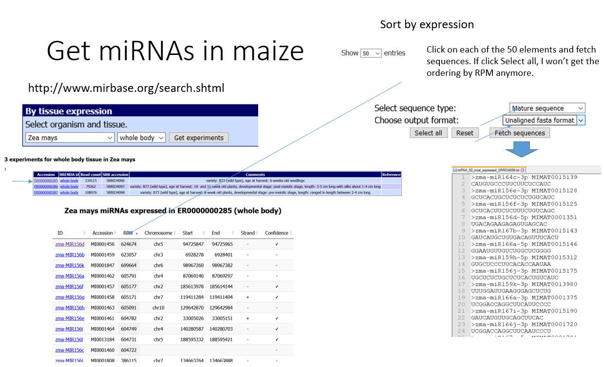

# Small RNA spike-in oligonucleotide design

This repository contains scripts used to design small RNA spike-in oligonucleotides (sRNA spike-ins). sRNA spike-ins can be used to normalize high-throughput small RNA sequencing (sRNA-Seq) data across individual experiments, as well as the genome-wide estimation of sRNA:mRNA stoichiometries when used together with mRNA spike-ins. The scripts and files contained within this repository were used to generate some of the data presented in [Lutzmayer et al. 2017](https://www.nature.com/articles/s41598-017-06174-3).

The repository has been modified to be used with other species. The scripts have been made compatible with Python3 and flexible in term of input file choice.

I detail here how we reused this pipeline to design sRNA spike-in oligonucleotides to quantify sRNAs from maize hybrid tissues.


# Softwares needed


## Python3

Should be installed by default on Unix machines. I recommend using conda to install specific libraries such as numpy.

Install Numpy for Python3

```{bash}
# Log to py3.7 environment (previously created using `conda create --name py3.7 python=3.7)
source activate py3.7

# Install numpy
conda install -c conda-forge numpy

```

## Bowtie

Need to retrieve semi-random sRNA sequences not matching the target genome

Check manual here http://bowtie-bio.sourceforge.net/tutorial.shtml#algn


```{bash}
# We have it already installed on our HPC and can use module
module load BOWTIE1/1.2.2

```

## RNAfold

This software is needed to 

Download code source from https://www.tbi.univie.ac.at/RNA/#download

Check documentation for installation https://www.tbi.univie.ac.at/RNA/documentation.html#install

```{bash}
tar -zxvf ViennaRNA-2.4.17.tar.gz
cd ViennaRNA-2.4.17
./configure --prefix=/usr/users/zicola/bin/ViennaRNA-2.4.17
make
make install

# Add the path of the binaries to your PATH /usr/users/zicola/bin/ViennaRNA-2.4.17/bin to PATH
export PATH="$PATH:/usr/users/zicola/bin/ViennaRNA-2.4.17"

```


# Rationale

Spike-in sRNAs are defined here as 21-nt oligos containing a 13-nt core sequence derived from the natural nucleotide frequency present in selected set of miRNAs, and four random nucleotides in 5' and 3'. These eight random nucleotides generates a subset of 65,536 oligonucleotides by 13-nt core sequence. This in order to minimize potential secondary structure events which could impede library preparation. The oligonucleotides also should contain a 5' monophosphate and a 2' methoxy group (also called 2'-O-methylation).


Picture derived from Lutzmayer et al. 2017.

# Obtain miRNAs as templates

The design of oligonucleotides is semi-random as it uses the frequency of nucleotides for each position based on real small RNAs. In that case, 21-nt miRNAs are used but it could as well be any other kind of smRNAs of a size of interest. The authors of Lutzmayer et al. 2017 used as template the 50% most expressed miRNAs in Arabidopsis so a total of 42 sequences (I guess from their own data but it is not clear in the materials and methods part).

First, download the miRNAs data of your species of interest. For instance, for maize, go to www.mirbase.org and use the mature sequences in fasta format.

Get the 50 miRNAs the most expressed in variety: B73 (wild type), age at harvest: 6-weeks-old seedlings (SRR034096) http://www.mirbase.org/summary.shtml?experiment=ER0000000285


- Go on http://www.mirbase.org/search.shtml
- By tissue expression > Zea mays > Whole body > ER0000000285
- Show 50 entries, sort by RPM, click on each of the 50 first entries, click Mature sequence, click unaligned fasta format, click Fetch sequences
- Copy-paste on file miRNA_50_most_expressed_SRR034096.txt

Note that many miRNAs have a 3' and 5' sequences so there are in total not 50 but 95 sequences.

NB: If I click on select all, I get all miRNAs but I don't get the sorting by RPM anymore. There is a total of 309 miRNAs in this dataset.





Assess the expression of all smRNAs available to have an idea of the distribution:


In that case, I chose the 50 more expressed as they are close to what was used in Lutzmayer et al. 2017 (42) and they cover the most expressed miRNAs. The choice of using most expressed miRNAs instead of all of them is not clear to me but it seems it represents better expressed miRNAs. The purpose is to direct the generation of semi-random oligos based on the nucleotide frequency for each position along a 21-mer sequence.

The fasta sequences of the miRNAs were pasted in `miRNA_50_most_expressed_SRR034096.fa`.


# Prepare genome for mapping

Download the fasta file of the genome you are interested in. For instance, we want to generate spike-in sRNAs to quantify small RNAs derived from an hybrid between the maize inbred lines B73 and Mo17 We therefore downloaded the two available genomes.

```{bash}
# B73 v4
wget ftp://ftp.ensemblgenomes.org/pub/release-41/plants/fasta/zea_mays/dna/Zea_mays.B73_RefGen_v4.dna.toplevel.fa.gz

# Mo17
wget https://download.maizegdb.org/Zm-Mo17-REFERENCE-CAU-1.0/Zm-Mo17-REFERENCE-CAU-1.0.fa.gz

# Uncompress
gunzip Zea_mays.B73_RefGen_v4.dna.toplevel.fa.gz Zm-Mo17-REFERENCE-CAU-1.0.fa.gz

# Generate bowtie indexes
# For B73
bowtie-build Zea_mays.B73_RefGen_v4.dna.toplevel.fa B73_RefGen_v4
# For Mo17
bowtie-build Zm-Mo17-REFERENCE-CAU-1.0.fa Mo17

```


# Design semi-random 13-nt oligonucleotides

Run the following command to generate a fasta file of 13-nt sequences with characteristics similar to endogenous miRNAs (i.e. random.fa). Note that the authors used 1000 random oligos but more are needed to get enough unmapped oligos when using bigger genome such as in maize.

```{bash}
python3 ../generate_semi_random_oligos.py miRNA_50_most_expressed_SRR034096.fa 100000
```

This script generates the `random.fa` file which will be used for mapping in the next step.


# Select unmapped 13-nt oligonucleotides

In our case, we want 13-nt oligos that map neither on B73 nor on Mo17 genomes, we therefore do the selection in 2 steps:

```{bash}
bowtie -f -v 0 --un noMatch_B73.fa B73_RefGen_v4 random.fa match_B73.fa
# reads processed: 100000
# reads with at least one reported alignment: 99462 (99.46%)
# reads that failed to align: 538 (0.54%)
# Reported 99462 alignments


```

I get now about 538 unmapped oligos, map these to Mo17 to be sure they don't match this genome either:

```{bash}
bowtie -f -v 0 --un noMatch_both.fa Mo17/Mo17 noMatch_B73.fa match_Mo17.fa
# reads processed: 538
# reads with at least one reported alignment: 280 (52.04%)
# reads that failed to align: 258 (47.96%)
# Reported 280 alignments

```

Out of 538 not mapping to B73, 280 align to Mo17 so it was important to do this step. We have a final set of 258 oligos that do not align to either genome.

# Calculate mininum free energy for miRNAs

This step allows to get an idea of the "natural" values of mininum free energy (MFE) for miRNAs. This will help in deciding which final oligos we keep to use as spike-in, i.e. oligos that have a MFE distribution as close to miRNAs as possible.

```{bash}
python3 ../calculate_mfe_endogenous_miRNAs.py miRNA_50_most_expressed_SRR034096.fa

```

This script generates two files: `mature.miRNA.seqs_folded` and `mature.miRNA.seqs_mfes`. The former contains the detail output of RNAfold while the latter contained the parsed MFE value only.


# Calculate mininum free energy for unmapped oligonucleotides

This step will add a NNNN prefix and NNNN suffix to each unmapped 13-nt so that 8 random nucleotides are added to each oligo. This gives 4^8= 65,536 21-nt oligos for each 13-nt core sequences. The idea behind is to limit the risk of unproper ligation due to secondary structure by diverisfying the possibilities of sequences. The 13-nt core will be used to define which spike-in is sequenced (it acts as a barcode). RNAfold will be run for each of these oligos to determine their respective MFE and the whole data will be summarized in an Excel file `summaryStats.xls` with for each 13-nt oligos with mininum, maximum, mean, and median MFE values. This script can take some times considering the millions of sequences to analyze.

```{bash}
python3 ../methods.sRNA.spike.in.design/methods.sRNA.spike.in.design.step2.py noMatch_both.fa
```


# Selection of oligonucleotides based on MFE profile


