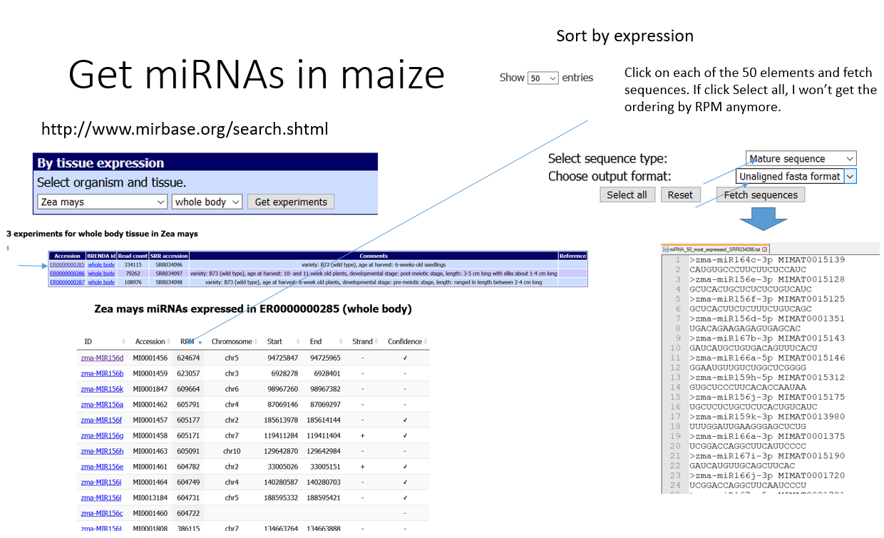
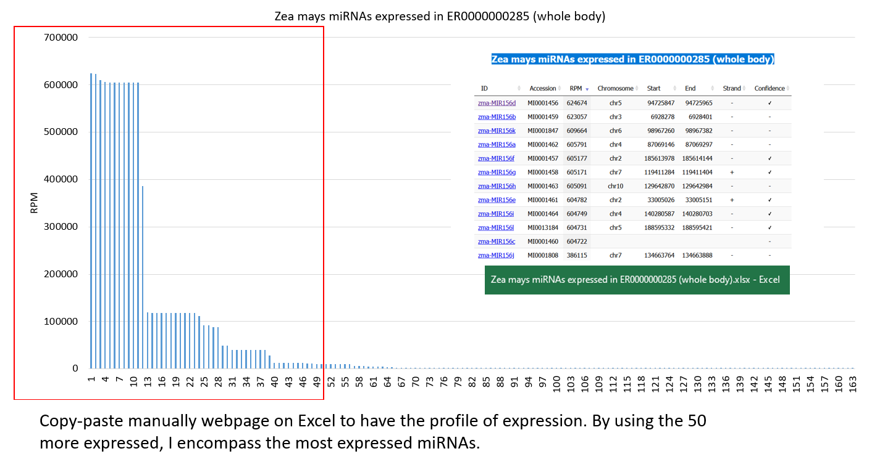

# Small RNA spike-in oligonucleotide design and analysis

This repository contains scripts used to design and analyze a novel set of small RNA spike-in oligonucleotides (sRNA spike-ins). sRNA spike-ins can be used to normalize high-throughput small RNA sequencing (sRNA-Seq) data across individual experiments, as well as the genome-wide estimation of sRNA:mRNA stoichiometries when used together with mRNA spike-ins. The scripts and files contained within this repository were used to generate all of the data presented in [Lutzmayer et al. 2017](https://www.nature.com/articles/s41598-017-06174-3).

The repository has been modified to be used with other species. The scripts have been made compatible with Python3 and arguments now need to be passed to avoid the lack of flexibility of the hard-coded variables used by the original authors.

I give here an example for maize.


# Softwares needed


## Python3

Should be installed by default on Unix machines. I recommend using conda to install specific libraries such as numpy.

Install Numpy for Python3

```{bash}
# Log to py3.7 environment (previously created using `conda create --name py3.7 python=3.7)
source activate py3.7

# Install numpy
conda install -c conda-forge numpy

```

## Bowtie

Need to retrieve semi-random sRNA sequences not matching the target genome

Check manual here http://bowtie-bio.sourceforge.net/tutorial.shtml#algn


```{bash}
# We have it already installed on our HPC and can use module
module load BOWTIE1/1.2.2

```

## RNAfold

This software is needed to 

Download code source from https://www.tbi.univie.ac.at/RNA/#download

Check documentation for installation https://www.tbi.univie.ac.at/RNA/documentation.html#install

```{bash}

tar -zxvf ViennaRNA-2.4.17.tar.gz
cd ViennaRNA-2.4.17
./configure --prefix=/usr/users/zicola/bin/ViennaRNA-2.4.17
make
make install

# Add the path of the binaries to your PATH /usr/users/zicola/bin/ViennaRNA-2.4.17/bin to PATH
export PATH="$PATH:/usr/users/zicola/bin/ViennaRNA-2.4.17"

```


## Obtain miRNAs as templates

The design of oligonucleotides is semi-random as it uses the frequency of nucleotides for each position based on real small RNAs. In that case, 21-nt miRNAs are used but it could as well be any other kind of smRNAs of a size of interest. The authors of Lutzmayer et al. 2017 used as template the 50% most expressed miRNAs in Arabidopsis so a total of 42 sequences (I guess from their own data but it is not clear in the materials and methods part).

First, download miRNAs data for your species of interest. For instance, for maize, go www.mirbase.org and use the mature sequences in fasta format.




Assess the expression of all smRNAs available to have an idea of the distribution:




In that case, I chose the 50 more expressed as they are close to what was used in Lutzmayer et al. 2017 and they cover the most expressed miRNAs. The choice of using most expressed miRNAs instead of all of them is not clear but it seems it may represent better miRNAs out there. The purpose is to direct the generation of semi-random oligos based on the nucleotide frequency for each position along a 21-mer sequence.


## Design semi-random oligonucleotides

1. methods.sRNA.spike.in.design contains files used to design and evaluate sRNA spike-ins.


Run the following command to a fasta file of 21 base sequences with characteristics similar to endogenous miRNAs (i.e. random.fa): 
```shell
python3 methods.sRNA.spike.in.design.step1.py 
```


Use Bowtie to select entries in random.fa generated from above step that do not map to Arabidopsis thaliana (TAIR10) genome or spike-ins (i.e. genome), and output to a file called noMatch.fa.
```shell
bowtie -f -v 0 --un noMatch.fa genome random.fa match.fa
```
To determine the folding structures (i.e. mature.miRNA.seqs.top50percent_folded) and minimum free energies (MFEs) (i.e. mature.miRNA.seqs.top50percent_mfes) of the top 50% expressed mature miRNAs, run the following command:
```shell
python methods.sRNA.spike.in.design.step2.endogenous.miRNAs.py
```
To determine the folding structures (i.e. randomOligoSets/folded/X.fa_folded) and minimum free energies (MFEs) (i.e. randomOligoSets/folded/mfes/X_mfes) of semi-randomly generated sequences from above (i.e. noMatch.fa), run the following command:
```shell
python methods.sRNA.spike.in.design.step2.py
```
To examine distributions of MFEs for each randomly generated set, as well as for the sets specifically used in this manuscript and generated for Supplementary Figure 4 (../supplemental.figure.4/supplemental.figure.4.pdf) run the following: 
```shell
Rscript examine.MFE.distributions.R
```
Please note that the MFE files used to generate the supplemental.figure.4.pdf have been deposited in the randomOligoSets/folded/mfes/ directory, but these will be different each time the above scripts are run because the sequences are randomly generated.


2. methods.data.analysis contains annotations and data analysis scripts to generate data files for small RNA-Seq and mRNA-Seq analyses.
Run the following command in the methods.data.analysis directory with the sample fastq file (e.g. col0_fb1.fa) downloaded from NCBI GEO (Series GSE98553) located within the sample directory (e.g. col0_fb1) to filter raw fastq file. Please note that sample directories and embedded sample.fastq files have to manually created and uploaded, respectively:
```shell
python sRNA_step1_var_qual.py sample 18 75 AGATCGGAAGA no 
```
In the methods.data.analysis directory, run the following command to generate a condensed fasta file where each sequence is represented once and the number of reads per sequence is noted in the entry name:
```shell
python sRNA_step2_v04.py sample 
```
Now use Bowtie to align the fasta file from above (i.e. sample.trimmed.fa) to the Arabidopsis thaliana (TAIR10) genome and ERCC spike-ins (i.e. genome):
```shell
bowtie -f -v 0 -m 100 genome sample/sample.trimmed.fa sample/tags.genome.bwt  
```
Run the following command to convert Bowtie output (i.e. tags.genome.bwt) to tab-delimited file of read attributes including hit-based and reads per million genome-matching read normalizations:
```shell
python bwtToAllHits_v03.py filepath sample total.number.of.genome.matching.reads 
```
Please note that the total.number.of.genome.matching.reads is the number derived from the Bowtie alignment above. Also, the filepath is the one leading up to the directory containing the various sample folders.

Now run the following command to convert files generated from the previous step (i.e. allgHits) to individual files containing collections of loci that reads map to (i.e. genomic hit collections) for miRNA gene, tasiRNA gene, transposon and sRNA spike-in loci.
```shell
python make_ghcsAndlDicts_slim.py sample yes yes filepath
```
To generate various files that organize reads that overlap miRNA genes (see comments in script for more details), run the following:
```shell
python miR_finder_v03.py sample filepath
```
To generate various files that organize reads that overlap tasiRNA genes (see comments in script for more details), run the following:
```shell
python tasiR_finder_anno_v03.py sample filepath
```
To generate files within the data.for.graphs directory with the RPM levels of miRNA families, tasiRNA families and 20-22 base or 23-24 base reads contained only within annotated transposons run the following:
```shell
python getMirsSirsAndTas_v02.py
```
To generate files within the data.for.graphs directory with the RPM levels of mature miRNAs, mature tasiRNAs and 20-22 base or 23-24 base reads contained within annotated transposons run the following:
```shell
python getMirsSirsAndTas_v03.py
```
To generate files within the data.for.graphs directory with the RPM levels of miRNAs and tasiRNAs coming from each annotated precursor, run the following:
```shell
python getMirAndTasPrecursorVals.py
```
To generate files within each sample directory containing the RPM levels of the sample's sRNA-Seq reads of a specified range as well as the base frequencies of the first read position, run the following:
```shell
python getLengthVals.py col0_leaf1,col0_leaf2,col0_fb1,col0_fb2,d234_fb1,d234_fb2 18 31 all 0
```


3. figure.1 contains files used to generate graphs, as well as example graphs, shown in Figure 1.
Run the following to generate the RPM vs. MPU scatterplots shown in Figure 1 and Supplementary Figure 1:
```shell
Rscript generate.RPM.vs.MPU.scatter.sRNAs.R
```
To generate the density plot shown in Figure 1C, run the following command:
```shell
Rscript generate.miRNA.density.R
```


4. figure.2 contains files used to generate graphs, as well as example graphs, shown in Figure 2.
Run the following to generate violin and scatter plots shown in Figure 2:
```shell
Rscript generate.sRNA.violins.and.miRNA.scatter.R
```


5. figure.3 contains files used to generate graphs, as well as example graphs, shown in Figure 3.
To generate scatter plots shown in Figure 3A and Supplementary Figure 3A-3E, run the following:
```shell
Rscript generate.TPM.vs.MPU.mRNA.R
```
Run the following command to create the one-dimensional strip chart shown in Figure 3B:
```shell
Rscript generate.precursor.strips.R
```
To generate the violin plots showin in Figure 3C, run the following:
```shell
Rscript generate.target.violins.R
```


6. supplemental.figure.1 contains example graphs shown in Supplementary Figure 1.
The example scatterplots were generated in Step 3 above.


7. supplemental.figure.2 contains files used to generate graphs, as well as example graphs, shown in Supplementary Figure 2.
To generate the length distributions shown in Supplementary Figure 2A-2C, run the following command:
```shell
Rscript generate.length.distributions.R
```
Run the following to generate a table (i.e. methods.data.analysis/small.RNA.Seq/data.for.graphs/total.rpm.mlc.table) of total RPM and MPU levels of miRNAs, tasiRNAs and siRNAs in the various samples:
```shell
Rscript generate.total.rpm.mlc.table.R
```
To generate one-dimensional strip charts as shown in Supplementary Figure 2D-2E, run the following command:
```shell
Rscript generate.rpm.and.mpu.strips.R
```


8. supplemental.figure.3 contains example graphs shown in Supplementary Figure 3.
The example scatterplots were generated with generate.TPM.vs.MPU.mRNA.R in Step 5 above.


9. supplemental.figure.4 contains an graph shown in Supplementary Figure 4.
The example violin plot was generated with examine.MFE.distributions.R in Step 1 above.
